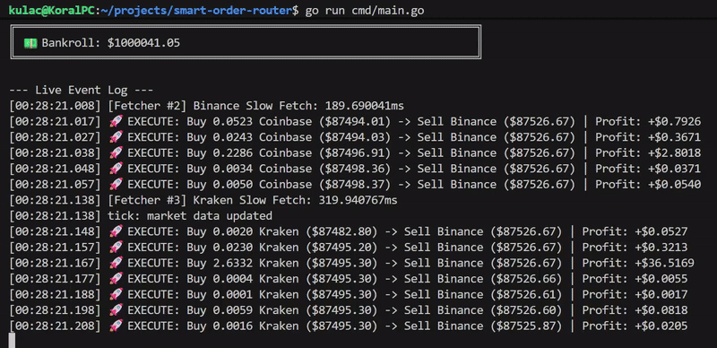
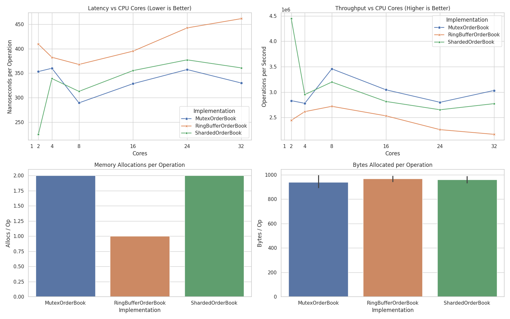

# Smart Order Router

A concurrent Smart Order Router (SOR) written in Go.



This application simulates an **arbitrage trading engine** that aggregates live order book data from multiple exchanges (Binance, Coinbase, Kraken) in parallel into a centralized "Global Order Book" to identify and execute profitable spread opportunities in real-time.

## How It Works

The system operates as a continuous high-frequency trading simulation:


### Data Ingestion

The system spawns concurrent Fetcher Workers for every exchange. These workers:

- Query external APIs (Binance, Coinbase, Kraken) in parallel.
- Normalize the JSON responses into a standard OrderBookEntry format.
- Push bids (buy offers) and asks (sell offers) into the Global Order Book.

### Global Order Book

This is a thread-safe memory structure protected by a Mutex. It uses two specialized Heaps to organize the data:

- Max-Heap (Bids): Keeps the highest buy price at the top (O(1) access).
- Min-Heap (Asks): Keeps the lowest sell price at the top (O(1) access).

### Arbitrage Execution

The Matcher Engine runs in a continuous loop separate from the fetchers.

1. Peeking: It looks at the top of both heaps.
2. Spread Detection: It checks if Highest Bid > Lowest Ask.
3. Execution: If a profit spread exists, it "executes" the trade for the maximum possible quantity.
4. Cleanup: It automatically removes filled orders or invalidates quotes older than 1 second to prevent stale trading.

## Local Setup

[Install Go](https://go.dev/doc/install) before running these commands:

```bash
git clone https://github.com/koralkulacoglu/smart-order-router.git
cd smart-order-router
go run cmd/main.go
```

### Starting Configurations

You can modify configs such as starting balance and fee rate in the `internal/config/config.go` file.

## Benchmarks

This project includes a comprehensive benchmarking suite (`benchmarks/`) to evaluate different Order Book concurrency patterns for high-frequency data ingestion.

I tested 3 architectural approaches under high-contention workloads (1-32 concurrent workers):

1. **MutexOrderBook:** A single global lock protecting the order book.
2. **RingBufferOrderBook:** A lock-free design using buffered channels to serialize writes.
3. **ShardedOrderBook:** A partitioned design that splits the order book into 32 symbol-based shards to minimize lock contention.

### Results (Intel Core i9-14900F)



- **Winner:** The **MutexOrderBook** unexpectedly outperformed the Sharded architecture at high concurrency (32 cores).
  - **Throughput:** ~3.05 Million ops/sec (vs 2.7M for Sharded).
  - **Latency:** ~330ns (vs 360ns for Sharded).

This proves that for extremely fast critical sections (<1µs), the overhead of **hashing and shard management** in the Sharded model exceeds the cost of **lock contention** in the Global Mutex model. Go's `sync.Mutex` implementation (which uses hybrid spin-locking) handles high contention efficiently enough that the added complexity of sharding was not justified.

The **RingBufferOrderBook** didn't even come close, which confirmed that single-consumer channel structures degrade linearly under high producer load.

### Running the Benchmarks

You can reproduce these results locally:

```bash
cd ./benchmarks
go test -bench=. -benchmem -cpu=1,4,8,16,24,32 -count=5 -json > benchmark_results.json
python3 plot_results.py
```
