# Smart Order Router

A concurrent Smart Order Router (SOR) written in Go.

This application simulates an **arbitrage trading engine** that aggregates live order book data from multiple exchanges (Binance, Coinbase, Kraken) in parallel into a centralized "Global Order Book" to identify and execute profitable spread opportunities in real-time.

## How It Works

The system operates as a continuous high-frequency trading simulation:

```mermaid
graph TD
    %% Styling - High Contrast
    classDef api fill:#ffcc80,stroke:#ef6c00,stroke-width:2px,color:#000;
    classDef internal fill:#90caf9,stroke:#1565c0,stroke-width:2px,color:#000;
    classDef storage fill:#ce93d8,stroke:#6a1b9a,stroke-width:2px,color:#000;
    classDef logic fill:#a5d6a7,stroke:#2e7d32,stroke-width:2px,color:#000;
    classDef exec fill:#ffab91,stroke:#d84315,stroke-width:2px,color:#000;

    subgraph External [🌐 External Exchanges]
        direction LR
        Binance[Binance API]:::api
        Coinbase[Coinbase API]:::api
        Kraken[Kraken API]:::api
    end

    subgraph App [⚙️ Smart Order Router]

        subgraph Producers [Data Ingestion]
            F1(Fetcher Worker 1):::internal
            F2(Fetcher Worker 2):::internal
            F3(Fetcher Worker 3):::internal
        end

        subgraph Store [🧠 Memory Model]
            GOB[("Global Order Book<br/>(Mutex Guarded)")]:::storage
            Bids{"Max-Heap<br/>(Bids)"}:::storage
            Asks{"Min-Heap<br/>(Asks)"}:::storage
        end

        subgraph Consumer [⚡ Execution]
            Matcher((Matcher Engine)):::logic
            Portfolio[Mock Portfolio]:::exec
        end
    end

    %% Connections
    Binance -->|Fetch| F1
    Coinbase -->|Fetch| F2
    Kraken -->|Fetch| F3

    F1 -->|Push| GOB
    F2 -->|Push| GOB
    F3 -->|Push| GOB

    GOB --- Bids
    GOB --- Asks
    GOB -->|2. Pop Best Orders| Matcher

    Matcher -->|3. Execute Trade| Portfolio
    Matcher -.->|4. Push Partial Fills| GOB
```



### Data Ingestion

The system spawns concurrent Fetcher Workers for every exchange. These workers:

- Query external APIs (Binance, Coinbase, Kraken) in parallel.
- Normalize the JSON responses into a standard OrderBookEntry format.
- Push bids (buy offers) and asks (sell offers) into the Global Order Book.

### Global Order Book

This is a thread-safe memory structure protected by a Mutex. It uses two specialized Heaps to organize the data:

- Max-Heap (Bids): Keeps the highest buy price at the top (O(1) access).
- Min-Heap (Asks): Keeps the lowest sell price at the top (O(1) access).

### Arbitrage Execution

The Matcher Engine runs in a continuous loop separate from the fetchers.

1. Peeking: It looks at the top of both heaps.
2. Spread Detection: It checks if Highest Bid > Lowest Ask.
3. Execution: If a profit spread exists, it "executes" the trade for the maximum possible quantity.
4. Cleanup: It automatically removes filled orders or invalidates quotes older than 1 second to prevent stale trading.

## Local Setup

[Install Go](https://go.dev/doc/install) before running these commands:

```bash
git clone https://github.com/koralkulacoglu/smart-order-router.git
cd smart-order-router
go run cmd/main.go
```

You should see something like this:

```
--- Starting Fetchers ---
--- Matcher Engine Started ---
💵 Bankroll: $1000000.00
[Fetcher #1] Coinbase fetched 5 bids, 5 asks in 126.335381ms
[Fetcher #3] Kraken fetched 5 bids, 5 asks in 162.896275ms
>>> 🚀 EXECUTE: Buy 0.0000 on Coinbase @ 86921.70 -> Sell on Kraken @ 86941.60 | Profit: $0.0000
[Fetcher #2] Binance fetched 5 bids, 5 asks in 186.816361ms
>>> 🚀 EXECUTE: Buy 0.0000 on Coinbase @ 86925.99 -> Sell on Binance @ 86962.03 | Profit: $0.0003
>>> 🚀 EXECUTE: Buy 0.0134 on Coinbase @ 86926.00 -> Sell on Binance @ 86962.03 | Profit: $0.2498
```

### Starting Configurations

You can modify configs such as starting balance and fee rate in the `internal/config/config.go` file.
